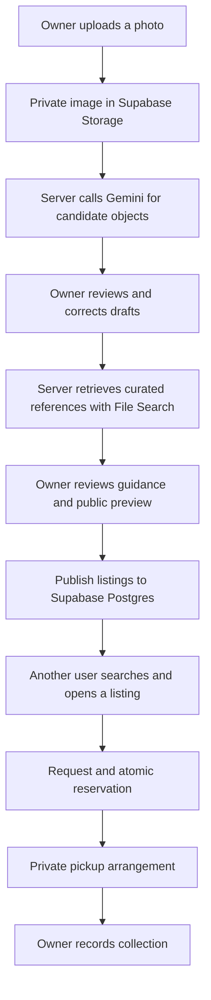

# ResourceDex — Product Requirements Document

**Version:** 1.0  
**Date:** September 12, 2026  
**Status:** Ready for implementation; requirements and targets below have not been implemented or validated.  
**First release:** A responsive web app for free material sharing and local pickup.

**Reading guide:** [Product and scope](#1-product-definition) · [User journeys](#6-user-journeys-and-functional-requirements) · [Gemini and RAG](#8-gemini-perception-contract) · [Architecture and data](#10-system-architecture) · [Build sequence](#16-build-sequence-and-dependencies) · [Demo](#17-demo-script-and-evidence) · [Acceptance checklist](#18-acceptance-checklist).

## 1. Product definition

ResourceDex turns a photo of spare materials, parts, and tools into a set of editable resource listings. Gemini helps identify visible objects. Retrieval-augmented generation (RAG) brings in reviewed reference knowledge to improve terminology and reuse guidance. The owner confirms what is actually available, then publishes selected items to Supabase so other people can discover and request them.

The product succeeds when useful materials become easier to identify, share, and collect. An impressive image analysis is only one step in that outcome.

**Core loop:** Photograph → identify → correct and confirm → retrieve guidance → review and publish → discover → request → reserve → collect.

### Confirmed decisions

- Gemini is the intended model provider for image analysis and generated assistance.
- RAG should improve the usefulness and grounding of model outputs.
- Supabase will persist the app's data and make published resources visible to other users.
- The first version supports **free sharing with local pickup**.
- The demo must use real persistence and work across different users.

### Build defaults established by this PRD

- Start with a mobile-friendly website; native mobile apps can follow.
- Start with a small community of makers, DIY users, students, and workshop organizers in one pilot area.
- Anyone can browse published resources. Posting, requesting, and managing resources require an account.
- One listing represents one object or one clearly described lot. A photo may create several listings.
- Use structured requests and pickup arrangements rather than a full chat system.
- Use Gemini File Search for the first RAG implementation. Supabase remains the source of truth for users, listings, requests, and availability.
- The first independently demoable milestone ends at cross-account discovery. The complete MVP includes pickup coordination.

These defaults make the specification buildable. They are product choices, not claims that every detail was agreed in the earlier brainstorming chat.

## 2. Problem, audience, and value

### Problem hypothesis

People accumulate useful offcuts, spare hardware, components, and tools. Identifying and describing each item takes effort, especially when its exact name is unknown. People looking for supplies cannot easily see what others have available. Generic AI descriptions can also sound certain about properties that a photo cannot establish.

This is a hypothesis to validate with pilot users; this PRD does not claim existing market research or proven demand.

| User | Job to be done | Successful outcome |
| --- | --- | --- |
| Resource owner | “Help me describe these items and give away the ones I choose.” | Publishes accurate listings with less typing and controls the handoff. |
| Resource seeker | “Help me find usable supplies available in my area.” | Understands a listing, requests it, and receives pickup details after acceptance. |
| Workshop organizer | “Help us make surplus visible to our community.” | Shares several items from a photo and tracks which remain available. |
| Pilot operator | “Help me keep listings and reference material trustworthy.” | Can hide inappropriate listings and maintain the approved knowledge collection. |

### Product promises

- Help identify and describe what is visible, while preserving uncertainty.
- Let owners correct every published claim about their items.
- Show current availability from the database.
- Explain reference-based suggestions with inspectable sources.
- Keep private drafts and pickup details separate from publicly shared content.

The interface must not promise that a model can certify material composition, structural strength, contamination, electrical safety, market value, or working condition from a photo.

## 3. Scope and priorities

**P0:** Required for the complete MVP. **P1:** Useful after the complete loop works. **Later:** Deliberately outside the initial build.

| Capability | Priority | Definition |
| --- | --- | --- |
| Accounts and sessions | P0 | Sign up, verify account, sign in, sign out, recover access. |
| Photo capture and upload | P0 | One image per scan, with a visible preview and retry. |
| Gemini object identification | P0 | Editable candidate items, visible descriptions, boxes, and unknowns. |
| Owner review | P0 | Rename, categorize, remove, add missed items, and confirm listing details. |
| Curated RAG | P0 | Retrieve reviewed references and generate limited, cited guidance. |
| Persistent drafts and manual entry | P0 | Work survives refresh; listing creation remains possible without AI. |
| Publishing to Supabase | P0 | Explicit publication, stable listing links, images, and availability. |
| Discovery and search | P0 | Keyword search, category, pickup-area filter, and available-first browsing. |
| Requests and reservations | P0 | Request a whole listing; owner chooses one requester. |
| Pickup and completion | P0 | Private arrangements, cancellation, and owner-recorded handoff. |
| Basic reporting and operator controls | P0 | Report a listing; operator can hide it and close affected requests. |
| Saved resources and notifications | P1 | Bookmarks and opt-in email or push updates. |
| Rich messaging and additional photos | P1 | Request conversations and multiple photos per listing. |
| Semantic inventory search | P1 | Natural-language discovery, always checked against live availability. |
| Labeled-image retrieval for recognition | P1 | Evaluate reference-image retrieval as a separate recognition improvement. |
| Payments, shipping, lending, bidding, ratings | Later | These add transaction and trust models not needed for free pickup. |
| Partial quantities and split reservations | Later | The MVP transfers an entire object or lot to one requester. |
| Automatic valuation or carbon estimates | Later | Require reliable measurement and defensible methods. |

The initial material scope is ordinary solid supplies: wood offcuts, metal offcuts, hardware, hand tools, containers, and craft or workshop materials. Unidentified chemicals, hazardous waste, and regulated items are outside the pilot's listing scope. A listing outside scope receives a clear explanation and cannot be published.

## 4. Core product principles

1. **The owner decides what is shared.** Uploading, analyzing, saving, or selecting an item never publishes it.
2. **Evidence has a type.** Separate image observations, owner statements, and reference guidance. “Owner confirmed” means the owner stated it, not that ResourceDex independently inspected it.
3. **Unknown is a useful answer.** Unknown material, count, dimensions, or working condition must remain representable.
4. **The database determines availability.** Generated text, cached searches, and embeddings never decide whether an item can be reserved.
5. **Assistance is optional.** A failed model call must not prevent manual listing creation.
6. **Publication is truthful.** Show the actual image or an owner-approved crop. Do not generate replacement product photos or cosmetically repair visible damage.
7. **The demo is honest.** Label sample records and recorded fallbacks; distinguish them from live results.

## 5. Information architecture and screens

Mobile navigation: **Explore**, **Share**, **My resources**, and **Requests**. Account controls live in a profile menu. Desktop uses the same destinations.

| Screen | Main content | Primary action | Required states |
| --- | --- | --- | --- |
| Explore | Search, area, categories, resource cards | Open a resource | Loading, empty community, no filter matches, error, results |
| Resource detail | Photo, owner facts, availability, area, guidance and sources | Request resource | Available, own listing, pending request, reserved, unavailable |
| Sign in / account | Authentication and recovery | Continue | Validation, verification pending, failure, signed in |
| Share | Camera/file input, image preview, manual entry | Identify items | Uploading, rejected file, upload error, ready |
| Scan review | Photo with numbered boxes and matching editable list | Continue with selected items | Analyzing, no detections, partial result, failure, saved review |
| Listing review | Item details, public image preview, guidance, area | Publish selected resources | Incomplete, saving, guidance pending/absent, ready, publish error |
| My resources | Drafts, available, reserved, completed, withdrawn | Resume or manage | Empty, loading, save conflict, results |
| Requests | Incoming and outgoing requests | Review a request | Pending, accepted, declined, canceled, fulfilled |
| Pickup arrangement | Accepted request and private collection details | Accept arrangement / confirm handoff | Waiting for details, waiting for confirmation, agreed, change requested, canceled, completed |
| Report listing | Reason and optional note | Submit report | Sending, submitted, failure |

Resource cards show the actual image, title, quantity or lot description, coarse pickup area, availability, and “Free.” Do not crowd cards with model names, confidence percentages, raw JSON, or retrieval details.

The detail page groups information as **About this resource**, **Possible uses**, and **Pickup**. Source details open from individual guidance claims. Unknown facts use readable text such as “Dimensions not provided.”

## 6. User journeys and functional requirements

### 6.1 Account and session — AUTH

- **AUTH-01:** Visitors can browse without signing in. Require a verified Supabase Auth account before uploading, publishing, requesting, or seeing private pickup information.
- **AUTH-02:** Implement email/password sign-up, verification, sign-in, sign-out, and password recovery for P0. Configure redirect URLs and email delivery for the deployed environment. Social sign-in is optional later.
- **AUTH-03:** Request a display name, not a public phone number or email. Keep authentication email in Auth rather than public profile data.
- **AUTH-04:** Preserve the intended destination after sign-in. If a session expires while editing, keep already saved drafts and allow the owner to resume after reauthentication.
- **AUTH-05:** Demo accounts are distinct real test accounts with separate sessions. Do not disable authentication or authorization to simplify the demo.

### 6.2 Capture and upload — PHOTO

- **PHOTO-01:** Support a device camera when available and ordinary file selection everywhere. Explain briefly: “Photograph the materials you want to share. Keep each item visible.”
- **PHOTO-02:** Accept JPEG, PNG, and WebP up to 10 MB per image. Validate file content, not just extension. For unsupported formats, preserve the page state and provide a readable conversion/re-upload message.
- **PHOTO-03:** Normalize orientation, record final dimensions, remove location metadata, and create a compressed working image with a longest edge up to 2,048 pixels. Preserve smaller inputs without enlargement. Reject decompression-bomb dimensions and invalid images server-side.
- **PHOTO-04:** Upload to private storage. Show a preview and let the owner replace or remove the image before analysis. No draft image appears in Explore.
- **PHOTO-05:** Explain before analysis that the photo will be sent to Gemini to identify items. Separately explain that only approved listing photos and fields become public when published.
- **PHOTO-06:** One scan accepts one image and returns at most 12 candidates. If this limit is reached, show that the result may be incomplete and encourage a second photo. Never label it “all objects found.”

### 6.3 Identify and correct — SCAN

- **SCAN-01:** Gemini returns candidate names, categories, visible observations, bounding boxes, and unknowns. Exclude people, body parts, worn clothing, floors, and unrelated installed background fixtures. Include clearly visible loose material offcuts.
- **SCAN-02:** Give each candidate a stable identifier within its scan. Display numbered boxes over the photo and a matching list. Tapping a list entry highlights its box; selecting a box focuses its entry.
- **SCAN-03:** Owners can rename, recategorize, delete false detections, select items to list, and add missed objects. A manually added item may have no box and must still be publishable with an approved image.
- **SCAN-04:** Boxes are review aids. P0 permits adjusting the public photo crop with ordinary crop controls; precise editing of detection boxes is P1. Invalid or unhelpful boxes must not prevent manual entry.
- **SCAN-05:** Each chosen object becomes its own draft. A bag or collection of small parts may be one lot when the owner describes it as such. Avoid creating duplicate listings for the same detection.
- **SCAN-06:** Debounced draft saves must show “Saving,” “Saved,” or “Couldn’t save.” Navigation while a save is pending offers a retry or explicit discard. Do not imply that unsaved data is durable.
- **SCAN-07:** Refreshing the page restores completed analysis and saved corrections. Re-running analysis creates a new version; it must not overwrite owner edits automatically.

### 6.4 Prepare a listing and retrieve guidance — LIST

Required publication fields:

| Field | Requirement |
| --- | --- |
| Title | Owner-reviewed, 3–80 characters; no unconfirmed exact model or grade. |
| Category | Wood, metal, hardware, tools, containers, craft supplies, or other in-scope solid material. |
| Description | 10–1,000 characters explaining what is included and visible limitations. |
| Quantity | Positive whole number with a unit, or one named lot whose count may be unknown. |
| Condition declaration | Owner selects new/unused, used, visibly damaged, or unknown; these are owner statements. |
| Working status | For tools/devices: working per owner, not working per owner, or not tested. |
| Material | Owner-specified where known; otherwise unknown. AI suggestions remain visibly tentative until reviewed. |
| Dimensions | Optional owner measurements with units; absent is unknown, never inferred from photo size. |
| Public image | Owner-approved actual photo or crop, with an editable plain-language alt description. |
| Pickup area | Required city, neighborhood, or named campus/community area selected by the owner. |
| Availability | Owner explicitly confirms the whole listing is available to give away for free. |

- **LIST-01:** Populate drafts with safe AI suggestions; require owner review before publication. Keep each confirmed value and its provenance.
- **LIST-02:** After item review, retrieve relevant references and propose at most three concise reuse ideas and three useful inspection questions per listing. Suggestions can be removed individually.
- **LIST-03:** A “Possible uses” claim must have valid source support and state material or condition prerequisites when those are unknown. Do not turn a generic reference into a claim about the photographed object's exact properties.
- **LIST-04:** If no suitable evidence exists, show “No matching reference found.” If the service fails, show “Suggestions unavailable.” Either state permits owner-reviewed manual publication without reference guidance.
- **LIST-05:** Owners may edit their description freely. Generated guidance with citations is immutable as an evidence record: remove it or regenerate it. Owner-written ideas appear as owner notes and cannot retain an AI citation badge automatically.
- **LIST-06:** Any saved change to listing content increments its content revision and makes existing generated guidance stale. Hide it until regenerated and reviewed; the listing can remain published with owner facts and no guidance. For P0, use this conservative rule even for a title correction. Rendering-only changes and availability transitions do not change the content revision or invalidate guidance.

### 6.5 Publish and manage — PUB

- **PUB-01:** Provide a final preview of exactly what another person will see, including the public image. Use the explicit action “Publish N resources.”
- **PUB-02:** Publish only selected, validated drafts. Publication is complete only after the server commits the listings and image references. Return durable listing IDs and links.
- **PUB-03:** A batch publishes all valid selected listings atomically or none. Upload required derived images before the transaction; failed transactions leave them private and eligible for cleanup. Retrying with the same operation key returns the original result.
- **PUB-04:** Published available listings are visible from another account and from a signed-out session. Reopening or refreshing must read the same data from Supabase.
- **PUB-05:** Owners can edit available listings, withdraw them, and republish withdrawn resources after review. Every saved change to public listing content increments its revision and cancels pending requests with the reason “Listing updated; request again.” Reserved listings require cancellation before content edits. Pure display formatting in the interface is not a content edit.
- **PUB-06:** Withdrawing a listing stops new requests, closes pending requests, cancels any accepted request, and revokes future pickup-detail access for the requester in the same transaction.
- **PUB-07:** Completed listings stay in owner and fulfilled-requester history, including their approved listing image, until the owner deletes the resource. They disappear from Explore. A visitor following an inaccessible, withdrawn, hidden, or nonexistent listing link sees a neutral “This resource is unavailable.” After deletion, participant request history shows a minimal unavailable/closed record with no resource photo or description.

### 6.6 Discover and request — FIND / REQ

- **FIND-01:** Explore defaults to available resources, newest first, with stable pagination of 24 records. Allow reserved resources through an explicit availability filter.
- **FIND-02:** Search published title, description, and category with database-backed keyword search. Combine search with category and coarse pickup-area filters. Preserve filters in the URL.
- **FIND-03:** Do not ask for precise device location in P0. Area filtering uses owner-selected place identifiers and labels; “Nearby” or exact-distance claims are not displayed without a verified distance implementation.
- **FIND-04:** Refetch after mutations, on window focus, and every 10 seconds while a discovery/request screen is visible. Realtime subscriptions are optional; correctness must survive disconnects and refreshes.
- **REQ-01:** A signed-in seeker can request the entire listing, give a short note up to 500 characters, and suggest a pickup window. Explain: “Your request is pending until the owner accepts.”
- **REQ-02:** Prevent self-requests, requests for unavailable items, and more than one active request by the same user for the same listing. A later new request after a terminal state is permitted.
- **REQ-03:** Owners see incoming requests and can accept one or decline. Seekers see their own outgoing requests and can cancel pending or accepted requests.
- **REQ-04:** Acceptance and reservation are a single database transaction. Revalidate owner identity, current availability, request state, and listing revision. Only one request may be accepted for a resource.
- **REQ-05:** On acceptance, decline other pending requests with a clear reason. If the accepted requester later cancels, the listing returns to available; previously declined requests are not silently reactivated.
- **REQ-06:** Declines and cancellations retain status history. P0 does not auto-expire requests or reservations. Show their age and provide manual cancellation so inactivity cannot trap an item indefinitely.

### 6.7 Arrange pickup and complete — PICKUP

- **PICKUP-01:** After acceptance, the owner supplies a meeting-place description, proposed date/time window, timezone, and optional instructions. These are visible only to the owner and the currently accepted requester. After fulfillment, those same participants retain access until 30 days after fulfillment, when the details are deleted. Cancellation revokes requester access immediately.
- **PICKUP-02:** The requester can agree to the arrangement or request a change with a short note. Every owner change increments the arrangement revision and clears agreement. Agreement must submit the revision the requester saw; reject an outdated revision and show the new proposal. This is a small coordination flow, not unrestricted chat.
- **PICKUP-03:** Precise pickup details never enter public listings, public profile fields, analytics payloads, or the RAG collection. Public description forms remind owners to keep exact addresses in the private arrangement.
- **PICKUP-04:** Either participant can cancel before completion, with an optional reason. Canceling an accepted request releases the reservation and removes requester access to future pickup-detail reads.
- **PICKUP-05:** The owner explicitly records “Mark as collected.” Atomically mark the listing completed and the accepted request fulfilled. Do not infer physical collection from time, messages, or requester confirmation alone.
- **PICKUP-06:** The UI describes completion as owner-recorded collection. Do not claim an independently verified handoff.

### 6.8 Basic community controls — MOD

- **MOD-01:** Signed-in users can report an inaccurate, unavailable, inappropriate, or out-of-scope listing. A report includes a reason and optional note, never public accusations.
- **MOD-02:** An operator can review reports and hide or restore a listing. Hiding cancels requests and removes public visibility through the same controlled workflow used for withdrawal. Restoring produces a withdrawn listing requiring owner review before republication.
- **MOD-03:** For the small pilot, operator actions can use authenticated administrative tooling with an audit record; a polished moderation dashboard is P1. Operator privileges must come from server-controlled roles, never editable profile metadata.

## 7. State model and invariants

### Scans and guidance

| Entity | States | Rules |
| --- | --- | --- |
| Scan | uploading → ready → analyzing → review_ready; failed or canceled | Failures retain any completed upload and saved drafts. A new run has a new analysis version. |
| Guidance | not_requested → retrieving → ready; no_evidence, failed, stale | Only ready guidance for the current listing revision can appear publicly. No-evidence and failure do not block manual publication. |
| Save | unsaved → saving → saved; failed | “Saved” requires server acknowledgment. |

### Listing and request transitions

| Action | Starting state | Result | Authority |
| --- | --- | --- | --- |
| Publish | draft or withdrawn | available | Owner after required-field and image validation |
| Send request | available | request pending; listing remains available | Another verified user |
| Accept request | available + pending | reserved + accepted; other pending requests declined | Owner, atomically |
| Decline request | pending | declined; listing unchanged | Owner |
| Cancel pending | pending | canceled; listing unchanged | Requester |
| Cancel reservation | reserved + accepted | available + canceled | Owner or accepted requester, atomically |
| Complete handoff | reserved + accepted | completed + fulfilled | Owner, atomically |
| Withdraw or operator hide | available or reserved | withdrawn; active requests closed | Owner or operator as applicable |
| Republish | withdrawn | available | Owner after review, when not operator-hidden |

Additional invariants:

- `reserved` implies exactly one accepted request; `available` implies none.
- Request states are exactly `pending`, `accepted`, `declined`, `canceled`, and `fulfilled`. Choosing another requester yields `declined`; owner edits, withdrawal, moderation hiding, or participant cancellation yield `canceled` with a reason code. “Close” is descriptive wording, not an additional stored state.
- A request stores the listing revision it concerned. Acceptance rejects stale revisions.
- Listing `revision` means content revision: title, description, quantity, category, condition, working status, material, dimensions, public image, and area changes increment it. Availability-only transitions leave it unchanged. Transactional state checks still guard every command.
- Arrangement agreement is bound to an exact arrangement revision. An older open tab cannot agree to replaced meeting details.
- Cancellation releases an item only when that same accepted request still owns a visible reservation. It cannot reopen a withdrawn or operator-hidden resource; concurrent commands must recheck these conditions inside the transaction.
- Every whole-lot handoff has one accepted requester; partial allocation is unsupported.
- Repeated commands are idempotent. Concurrent accept/cancel/withdraw/complete operations use locking or conditional updates inside one transaction.
- For state conflicts, the server returns the actual latest state and a useful message, not a misleading success.
- All authorization, transition rules, and validation apply to direct API/database access as well as the UI.

## 8. Gemini perception contract

Gemini supports image-based object detection with normalized boxes. Google's documented convention is `[y_min, x_min, y_max, x_max]` on a 0–1000 scale. The application must use one explicit adapter and test the conversion, since the earlier experimentation used a different coordinate order. [Google image-understanding documentation](https://ai.google.dev/gemini-api/docs/image-understanding)

### Analysis input

- One normalized working image, its stored dimensions, and an internal image ID.
- A versioned prompt defining the in-scope objects and exclusions.
- A structured response schema with a maximum of 12 candidates.
- No instructions from image text, user descriptions, or retrieved documents may change application permissions, destination services, or publication behavior.

### Canonical stored result

| Field | Meaning |
| --- | --- |
| `analysis_id`, `scan_id`, `image_id` | Stable links to the run and actual source image. |
| `model_id`, `prompt_version`, `schema_version`, `created_at` | Reproducibility information. |
| `candidate_id`, `label`, `category` | Suggested identity, with broad wording when uncertain. |
| `bounds` | Named `x_min`, `y_min`, `x_max`, `y_max` integers, each 0–1000; null for a manual candidate or an AI candidate with invalid/missing localization. |
| `localization_status`, `localization_reason` | localized, manual_unlocalized, or invalid_ai_box; readable reason where necessary. |
| `visible_observations[]` | Brief descriptions supported by the photo. |
| `unknowns[]`, `owner_questions[]` | Details requiring clarification or physical inspection. |
| `review_status` | pending, corrected, confirmed, or removed. |

Server validation checks JSON shape, permitted categories, text lengths, finite coordinates, bounds ordering, positive area, image association, candidate count, and duplicate identifiers. Do not silently swap coordinate axes to make a result fit. An invalid box may be discarded while retaining an explicitly unlocalized draft if its remaining fields validate. Label that candidate “Location needs review” and let the owner associate an approved photo/crop or remove it.

Scale bounds against the orientation-normalized image and account for letterboxing or cropping in the rendered image. Test portrait, landscape, resized mobile, and rotated-camera cases.

Do not request or display hidden reasoning. Use the final structured answer. Structured output helps enforce format; it does not establish that an identification is true. Validate content as well as shape. [Google structured-output documentation](https://ai.google.dev/gemini-api/docs/structured-output)

Do not show model-generated confidence as a calibrated accuracy percentage. Prefer concrete uncertainties, such as “Exact metal type unknown.”

## 9. RAG product and content specification

### Purpose and implementation decision

The first RAG version targets more consistent terminology, relevant explanations, and better-supported reuse guidance **after** the owner reviews candidate items. It is not a promise of improved box accuracy. Recognition improvements from reference-image retrieval require a separate experiment.

Use a curated **Gemini File Search store** as the first retrieval backend. It manages document indexing and retrieval and can return source annotations. Citations are not guaranteed on every answer, so the application must handle missing evidence. Do not combine File Search with other built-in grounding tools in the same call. [Google File Search documentation](https://ai.google.dev/gemini-api/docs/file-search)

Supabase stores approved source metadata and the guidance attached to listings. It does not need a second vector index in P0. A future move to Supabase/pgvector is an architecture change to justify with retrieval-control, access, or cost needs, not an additional MVP dependency.

### Knowledge collection

Create an initial collection of **20–30 reviewed reference entries**, covering the pilot's categories. This is a build deliverable; no such corpus currently exists in this workspace.

Prefer manufacturer documentation, recognized materials or reuse organizations, and attributable educational guides. Record the right to store and use each source. Do not ingest arbitrary websites, personal files, private messages, or unreviewed model-written articles.

Each reference record contains:

- Stable source ID, title, publisher, canonical source URL, and source type.
- Original publication/revision date where available, review date, and active/withdrawn status.
- Version or content hash, provider document ID, and ingestion status.
- Material/category tags, relevant synonyms, supported topics, and applicability limits.
- Content usage basis; excerpt or section locator sufficient for review.
- Operator who reviewed it and any reason for withdrawal.

Prepare concise entries by topic, keeping the claim and its conditions together. Examples of entry topics are identifying broad types of hardware, describing wood offcuts without guessing grade, and possible uses of storage containers. These are corpus topics, not pre-approved claims about a user's objects.

Ingest only reviewed entries. Wait for indexing completion and run a retrieval check before marking a corpus version ready. Use a versioned active store so an incomplete replacement does not disrupt the current collection. Withdrawn sources must be excluded from new generation and their displayed guidance suppressed pending review.

At ingestion, attach the internal source ID and content version/hash to provider document metadata. Maintain a versioned registry keyed by provider store/document identity. Resolve citations through that registry and its metadata, not display filenames or model-written URLs. Two documents with the same title must remain distinguishable.

### Runtime retrieval and generation

1. Construct a query from owner-reviewed item identity, material if known, visible description, and the type of guidance requested. Keep unknown attributes explicit.
2. Restrict retrieval to the active curated collection. User listings and private pickup data are not sources in this collection.
3. Ask for at most three concise guidance claims per item, supporting source identifiers, relevant conditions, and remaining unknowns. Batch the selected items for one scan when the response stays within the configured limit.
4. Parse actual provider source annotations. Map them to active source records; do not trust URLs or IDs invented in generated prose.
5. Save each proposed claim with an immutable claim ID, exact resource ID, input revision, source mapping, source version/section where available, and applicability. Preserve the provider annotations needed to audit this join. For batches, validate each item-to-claim-to-source relationship independently. The owner reviews it before publication.
6. If a claim lacks a resolvable active source or contradicts known owner facts, omit it. If no supported claims remain, return no-evidence.

Citation mapping proves that a reference was retrieved, not that it supports the claim. During evaluation, a reviewer must verify source support. Runtime generation must be constrained to the supplied evidence and must never label citation presence as factual verification.

If the chosen model/API supports retrieval and the required JSON schema together, use that path after a smoke test. Otherwise, use a bounded retrieval response followed by a schema-constrained formatting call. Supply the actual supporting excerpts and applicability conditions plus an authoritative allowlist of source IDs, not just an intermediate answer and IDs. The formatting call may format or omit claims but cannot introduce facts. If the API cannot provide sufficient source content, resolve it from the reviewed corpus or return no-evidence. Validate this fallback against invented IDs and unsupported additions.

Before attaching an asynchronous result, recheck that its input revision still matches the draft; discard stale results without overwriting owner corrections. When serving public guidance, recheck current source-active status so a withdrawal suppresses previously published claims as well as new generation.

### Evidence types and publication rules

| Evidence type | Example wording | Required support |
| --- | --- | --- |
| Image observation | “Visible holes along one edge.” | Source image and observation record. |
| Owner statement | “Owner reports a length of 40 cm.” | Owner-entered value and confirmation timestamp. |
| Reference guidance | “A possible use is …, provided …” | Active source mapping and stated applicability. |
| Unknown | “Working condition has not been tested.” | Explicit absence of confirmation; no invented certainty. |

Do not put owner corrections directly into the global RAG corpus. They can inform a private evaluation dataset only under a defined opt-in process in a later release.

## 10. System architecture

### Recommended build stack

- **Frontend:** React with [Next.js](https://nextjs.org/docs) App Router and TypeScript, [Tailwind CSS](https://tailwindcss.com/docs) for styling, responsive layouts, accessible form components, and conventional server/client separation. Pin compatible package versions during setup and commit the lockfile.
- **Backend:** Server-only application endpoints for AI calls, image processing, and authenticated commands; database transactions for coupled state changes.
- **Supabase Auth:** Account identity and session management.
- **Supabase Postgres:** Profiles, drafts, resources, requests, arrangements, source metadata, and evidence records.
- **Supabase Storage:** Private scan uploads and controlled access to approved listing images.
- **Gemini:** Separate perception and reference-guidance stages with configurable model IDs.
- **Gemini File Search:** Reviewed reference collection, indexed before runtime use.
- **Deployment:** Vercel is the proposed Next.js host, subject to verifying function limits against the processing deadlines below. Use separate Supabase and Google project configuration. Keep preview/demo and future production data separate.

The browser uploads image bytes directly to a constrained private Supabase Storage destination, then sends only the scan/object identifier to the application server. The server validates the stored bytes, normalizes the image, and calls Gemini. Do not proxy the allowed 10 MB upload through a Vercel request handler: the documented function payload limit is 4.5 MB. Invalid uploads remain quarantined and are deleted; only validated images can reach analysis or publication. [Vercel function limits](https://vercel.com/docs/functions/limitations)

The browser may read and write ordinary permitted data using a Supabase publishable key under Row Level Security (RLS). Gemini credentials and Supabase secret/service credentials remain server-only. If a privileged server client is used, endpoints must explicitly authorize each operation because that client can bypass RLS.

For P0, bounded AI requests may run within the server request lifetime, with a persistent analysis record. Completed results are durable. An interrupted or timed-out request may need retry; do not claim it continues after the browser closes. Use a durable worker later if execution must survive request termination. The deployment must support the configured processing deadlines.

## 11. Supabase data model

This is a logical schema. The builder must turn it into migrations, indexes, constraints, and tested policies before connecting public clients. Use UUID primary keys, UTC timestamps, foreign keys, and server-generated ownership/timestamp fields. Monetary amounts are unnecessary for the free-only MVP.

| Table | Essential fields | Visibility and responsibility |
| --- | --- | --- |
| `profiles` | `id` referencing Auth user, `display_name`, `created_at` | Public-safe fields only. Owner can edit their name; public reads cover owners of visible listings. Authenticated users can also read their own profile and the display names of their request counterparties. Email stays in Auth. |
| `areas` | `id`, `label`, `region_label`, `active` | Public read; operator write. A small list of pilot pickup areas. No precise coordinates required. |
| `scans` | `id`, `owner_id`, `image_asset_id`, `status`, `active_analysis_id`, timestamps | Owner-only workflow record. |
| `image_assets` | `id`, `owner_id`, `scan_id`, `resource_id`, `kind`, `storage_path`, content hash, MIME, width, height, `status` | Owner-only metadata for scans; an approved derivative can be served when its resource is visible. |
| `analysis_runs` | `id`, `scan_id`, `owner_id`, state, model/prompt/schema versions, input hash, start/deadline/finish times, output JSON, error code, token usage | Owner can see sanitized result/status; raw provider/debug fields stay server-only. |
| `scan_candidates` | `id`, `analysis_id`, `owner_id`, stable candidate key, label, category, named bounds, observations, unknowns, review status | Owner-only. Removed candidates remain out of publication. |
| `resources` | `id`, `owner_id`, optional `candidate_id`, state, moderation state, title, category, description, quantity/unit/lot label, condition, working status, material, dimensions/unit, `area_id`, `primary_image_id`, revision, confirmation time, published/completed timestamps | Drafts and withdrawn records owner-only. Available/reserved records have a public read policy. Completed records are readable by the owner and fulfilled requester for history. All columns here must be safe for public display when published. |
| `resource_reviews` | `resource_id`, revision, field provenance, original suggestions, owner corrections, confirmed by/at | Owner and server only. Keeps private editing history separate from the public listing row. |
| `guidance_runs` | `id`, owner, scan/resource references, input revisions/hash, corpus version, state, provider request metadata, timing/usage/error | Owner sees safe status; server controls the evidence records. |
| `resource_guidance` | `id`, `resource_id`, listing revision, claim text, applicability/unknowns, review status, `guidance_run_id` | Public only when approved, current, source-active, and attached to a publicly visible listing. |
| `knowledge_sources` | `id`, title, publisher, canonical URL, source version/hash, publication/review dates, tags, usage basis, active flag | Approved citation metadata may be public. Operator writes. |
| `knowledge_documents` | `id`, `source_id`, corpus version, provider store/document identifiers, indexing state, source text or secure pointer | Server/operator only. Stores ingestion configuration and approved retrieval content. |
| `guidance_citations` | `guidance_id`, `source_id`, source version, locator, supported excerpt if permitted, provider annotation mapping | Public-safe source display follows guidance visibility. Provider/internal details are exposed only through safe projections. |
| `requests` | `id`, `resource_id`, `requester_id`, listing revision, note, proposed window, state, reason, timestamps | Resource owner and requester only; no public request lists. |
| `pickup_arrangements` | `request_id`, meeting place, start/end time, timezone, instructions, arrangement revision, agreement state, change-request note | Owner and currently accepted requester only; fulfilled participants retain access for the limited retention period. |
| `reports` | `id`, `reporter_id`, `resource_id`, reason, note, state, timestamps | Reporter can see receipt; operator handles details and decisions. |
| `command_results` | actor, operation type, idempotency key, request hash, safe result/reference, creation/expiry | Server-only, used for retry-safe publication and workflow commands. |
| `audit_events` | actor, entity ID, action, before/after state, timestamp, correlation ID | Server/operator only; omit private free text and images. |

### Required integrity rules

- Foreign keys and authorization verify that a resource's scan, candidate, and images belong to its owner. A submitted foreign image ID cannot attach another user's private upload.
- Unique `(analysis_id, candidate_key)` and at most one resource draft per candidate prevent duplicate creation. Manual entries have no candidate relationship.
- Quantity is positive where specified; lot count and individual-item count are not conflated. A lot can contain an unknown number of pieces.
- Use one normalized unit per dimension set, require nonnegative finite values, and preserve which dimensions the owner actually entered.
- Require image readiness, owner confirmation, current revision, and all publication fields before `available` can be set.
- Enforce a unique accepted request per resource and a unique active request per requester/resource. Add foreign keys and state checks; use transactions for cross-row invariants.
- Index ownership, resource state/publication order, area/category filters, request participants/state, and searchable listing text.
- Keep public listing rows free of private pickup fields and raw AI responses. RLS is row-level access control; do not rely on hiding sensitive columns in the frontend.
- Keep mixed/internal records such as raw analysis, provider annotation mappings, ingestion configuration, command results, and audit logs in an unexposed schema or with all ordinary client table access revoked. Return only authorized safe fields through endpoints; a table marked “sanitized status” is not permission to expose its raw columns.
- Ordinary clients cannot directly update workflow state, moderation state, ownership, generated evidence, or acceptance fields. Restrict these writes with grants/policies and expose only the validated commands. Owner authorization alone does not authorize arbitrary state assignment.

## 12. Access control, image delivery, and retention

### Access matrix

| Data/action | Visitor | Signed-in non-owner | Owner / request participants | Operator |
| --- | --- | --- | --- | --- |
| Available/reserved listing and approved guidance | Read | Read | Read | Read/hide |
| Completed listing and approved listing image | None | None unless fulfilled requester | Owner and fulfilled requester until resource deletion | Audited support only |
| Draft, scan, original upload, review history | None | None | Owner only | No default access; exceptional support access audited |
| Edit/publish/withdraw listing | None | None | Owner through validated commands | Hide/restore through operator commands |
| Request resource | None | Own request if eligible | Owner cannot request own listing | No special requester bypass |
| Read request | None | Own requests only | Requester and resource owner | No default broad access |
| Accept request / complete handoff | None | None | Resource owner only | Can cancel through moderation action |
| Pickup arrangement | None | None | Owner and accepted requester; after fulfillment, those participants for 30 days; canceled requester loses access immediately | No default access |
| Curated source management | Read approved citation metadata | Same | Same | Approve, ingest, withdraw |

Enable RLS on every table exposed through the Data API, with policies matching this matrix. Use explicit table/column grants as well as policies. Ownership-changing updates must be prevented, and policies must protect both the existing and replacement row. Public views must preserve the intended caller permissions. [Supabase RLS documentation](https://supabase.com/docs/guides/database/postgres/row-level-security)

Do not solve access failures by opening all tables to authenticated users. Test with a visitor, owner, requester, and unrelated account. Apply the same controls to retrieval helpers, functions, and server endpoints. Restrict execution of privileged database functions and validate actor identity inside the transaction.

### Image access

Use private buckets for both raw uploads and listing derivatives. An image-serving endpoint checks current listing visibility or owner/fulfilled-participant access and issues a short-lived URL, proposed lifetime **five minutes**. Anyone may obtain a URL for a currently public listing image; only the owner may obtain one for a scan/draft. For completed-resource history, permit the owner and fulfilled requester to view the approved listing derivative until resource deletion, never the private scan original. Disable public caching of authorization decisions and private responses.

The owner chooses the actual public image/crop during preview. A full-scene image may be shared only after that preview makes the included background clear. Generated crops must remain private until their listing publishes. Uploads and replacements must verify owner/path association and object readiness.

Withdrawing stops new image URL issuance. A previously issued URL may continue to work until its expiry, and downloaded copies cannot be recalled. Do not claim immediate revocation of already shared images. Supabase Storage policies provide the underlying upload/read controls; browser access must never contain a secret/service key. [Supabase Storage access-control documentation](https://supabase.com/docs/guides/storage/security/access-control)

### Proposed retention defaults

- Keep active listing images while needed for the listing. Retain completed/withdrawn records for the owner's history until deletion.
- Delete private abandoned scan assets after 30 days of inactivity, unless an active draft still references them; show the retention notice in the upload flow.
- Remove unattached derivative uploads after 24 hours. Never delete an asset still referenced by a draft, published listing, or active processing run.
- Retain sanitized diagnostic data for seven days and aggregate usage metrics for 90 days. Avoid retaining raw provider prompts/responses beyond what the private review flow requires.
- Remove precise pickup arrangements 30 days after fulfillment or cancellation. Canceled requesters lose read access immediately even before the retention job deletes the record.
- Provide owner draft deletion and resource deletion from history. Deleting a live resource first withdraws it and closes active requests. A deletion job removes its images, AI data, and public metadata; counterpart request history retains only a minimal unavailable/closed record.
- Account deletion is a documented operator-assisted pilot workflow, requested from Account. It revokes sessions, withdraws resources, cancels requests, and deletes/anonymizes related data without deleting another user's account or resources. A self-service UI is P1.
- Publish the data-handling notice before inviting external pilot users. Disclose image processing by Google and storage by Supabase; do not promise a provider retention or training policy that has not been verified for the configured service tier.

These are product retention choices to implement and test, not a claim of legal compliance or an assertion about provider defaults.

## 13. Server contracts and validation

Endpoint names below are logical contracts; the implementation may use route handlers plus database functions. Inputs are validated server-side. Derive the user from a verified session, never from a caller-supplied owner ID.

| Operation | Input | Required result and protections |
| --- | --- | --- |
| Create scan/upload | File metadata and operation key | Private scan ID and constrained upload destination; validate MIME/size/ownership. |
| Analyze scan | Owned scan ID, expected image hash, operation key | Analysis ID and final or recoverable status; reject concurrent duplicate runs. |
| Read analysis | Analysis ID | Owner-authorized status and safe result; mark expired running records timed out. |
| Save draft | Draft/candidate ID, edits, expected revision | Saved revision; reject ownership mismatch or conflicting edit. |
| Enrich drafts | Owned IDs/revisions, corpus version, operation key | Guidance status, validated claims, and mapped citations; stale input cannot attach to newer edits. |
| Publish batch | Selected draft IDs/revisions, image approvals, operation key | Committed listing IDs/links; all-or-nothing publication. |
| Discover/detail | Search, filters, cursor or listing ID | Only public-safe current listings; neutral unavailable result for inaccessible IDs. |
| Participant history | Verified session and pagination cursor | Owned resources or the requester's fulfilled resources, with approved image access; minimal closed records after deletion. Never expose another requester's history. |
| Create request | Listing ID/revision, note/window, operation key | Persisted pending request or current-state conflict. |
| Accept/decline/cancel | Request ID, expected state, operation key | Atomic authorized transition and latest listing/request state. |
| Set/agree pickup | Accepted request ID, expected arrangement revision, details/action | Participant-authorized arrangement; only latest revision can be agreed. |
| Complete/withdraw/edit | Listing ID, expected revision/state, operation key | Authorized transaction, request side effects, new state. |
| Report/hide | Listing ID, reason, operation key | Private report receipt or operator-audited moderation transition. |

### Reliability and budgets

- A published result is acknowledged only after the database commit. Cache invalidation/refetch follows success.
- An idempotency key is scoped to actor and operation. Reusing it with a different payload is rejected. Store replay results for at least 24 hours; permanent constraints still prevent duplicates afterward.
- Use proposed provider deadlines of 30 seconds for detection and 30 seconds for a single grounding call. If grounding needs a second formatting call, cap the entire enrichment operation at 60 seconds. Configure server execution limits with margin above the application deadline.
- Permit at most one automatic retry for a transient provider failure when it fits within the total deadline. No unbounded retries. User-triggered retries reuse the completed result when inputs match and create a new attempt only after a failed attempt is terminal.
- Treat timed-out or disconnected analysis as uncertain until its stored state is read. An expired attempt cannot overwrite a newer attempt's result.
- Starting defaults: one active scan per user, 10 analysis attempts per hour, 30 per day, and 20 request submissions per hour. Count billable retries against limits; tune during the pilot.
- Log stage latency, model/corpus versions, token usage where supplied, error category, and request correlation ID. Do not log images, exact addresses, email, or full user notes to general analytics.
- Keep a configurable operator-set daily AI spend ceiling. Before deployment, measure actual per-scan/per-guidance cost and select the ceiling. On exhaustion, disable new AI calls and keep browsing/manual listing creation working.
- Do not hardcode a model name from memory. Select a model available to the configured account, verify vision, JSON, and File Search support with live smoke tests, then pin its identifier in server configuration and evaluation records.

### Error behavior

| Failure | User-facing behavior | Data behavior |
| --- | --- | --- |
| Invalid/oversized upload | Explain accepted formats and limit; allow another file | No public data; retain unrelated saved work |
| Upload interrupted | Retry upload or replace image | Resume existing scan where possible; prevent duplicates |
| No identifiable objects | “No clear items found. Add an item or try a closer photo.” | Keep image private; manual entry enabled |
| Invalid model JSON or refusal | “We couldn't identify these items. Retry or add them yourself.” | Record failure safely; never render raw output as trusted HTML |
| Invalid boxes / partial result | Show usable candidates and explain incomplete localization | Invalid boxes omitted; nothing auto-published |
| Gemini or RAG unavailable | Keep existing draft; offer retry/manual continuation | No fabricated detections, guidance, or citations |
| Source absent or withdrawn | Omit unsupported guidance | Retain provenance privately; invalidate public claim |
| Save or publish failure | Show failure and retry; no success toast | Preserve saved draft; idempotent retry |
| Stale reservation | Explain “This resource has already been reserved.” | Server returns actual state; no second acceptance |
| Session expired | Sign in to continue | Saved owner data stays private and recoverable |
| Network loss | Show connectivity state; retain current view | No false saved/requested/collected state |

## 14. Visual and interaction requirements

ResourceDex should feel like a useful community resource catalog: photo-led, calm, legible, and quick to scan.

- Use warm neutral backgrounds, restrained green accents, dark readable text, and a clear type hierarchy. Treat these as starting design tokens, not a requirement for a specific font or component library.
- Give real material photos priority. Avoid a chatbot-first layout, excessive gradients, decorative dashboards, and unnecessary animations.
- Keep Share reachable from the main navigation. On mobile, use a visible primary action at the end of each step and preserve edited fields when moving back.
- Display available, reserved, completed, and unknown states with text as well as color. “Free” and pickup area should be easy to find.
- Use numbered image overlays with a matching list. Every important action must be usable without precise dragging; provide keyboard-accessible crop positioning or an uncropped-image option.
- Forms need persistent labels, inline errors, clear required/optional markers, and screen-reader announcements for save, analysis, and publication results.
- Support 320-pixel-wide screens, keyboard-only navigation, visible focus, reduced motion, and 200% text enlargement without hiding essential actions. Aim for 44-pixel touch targets and at least 4.5:1 contrast for ordinary text.
- Loading states describe the real step: “Uploading photo,” “Identifying items,” or “Finding references.” Do not show invented progress percentages or a model's hidden reasoning.
- Use plain copy: “Review items,” “Material unknown,” “Publish resources,” “Request pickup,” “Waiting for owner,” and “Mark as collected.”

## 15. Success metrics and evaluation

All numerical thresholds in this section are **proposed release targets**, not observed performance. Record the dataset, sample sizes, model, prompt, corpus version, and environment with every result.

### Product outcomes

| Metric | Definition | Initial target |
| --- | --- | --- |
| Cross-user discoverability | Committed listing can be found by a separate eligible session | 100% of scripted test publications |
| Publication usability | New test user publishes at least one intended item without moderator help | At least 4 of 5 usability participants |
| Time to first listing | From completed upload to first publication, excluding account setup | Median under three minutes in the pilot test |
| Successful handoff flow | Separate owner/requester complete request → acceptance → arrangement → owner-recorded collection | All scripted end-to-end cases pass |
| Completed exchanges | Distinct fulfilled requests, excluding sample/test records | Measure during pilot; do not invent a launch volume goal |
| Correction burden | Number/type of owner edits and missed/false candidates per scan | Establish baseline and reduce without hiding uncertainty |

### AI and RAG evaluation

- Before calling the demo ready, label at least **20 varied photos containing at least 100 in-scope objects**. Include clutter, small hardware, duplicate objects, partial occlusion, ambiguous materials, poor lighting, and a photo with no in-scope items. Keep this set separate from prompt-tuning examples.
- Proposed detection gates: at least 90% precision and 80% recall on that set. Define an identification match by reviewer-approved semantic identity. Separately require at least 90% of correctly identified objects to have bounding-box intersection-over-union (IoU) of 0.5 or above. Report raw counts; one staged photo does not establish general accuracy.
- Build **30 reference test cases**, including at least five no-evidence, five ambiguous-input, and three conflicting/withdrawn-source cases. The categories may overlap.
- Run the same cases with and without RAG using the same confirmed item facts and model settings. Measure naming correctness, relevance, supported claims, unsupported claims, latency, and actual token cost. RAG must show a recorded improvement in support or relevance without increasing unsupported claims; otherwise revise the corpus/retrieval before claiming improvement.
- Every displayed reference claim must resolve to a real active source record. Require at least 95% reviewer-assessed source support among generated claims in the evaluation set, with unsupported or unsafe item-specific properties blocking release regardless of the aggregate score.
- Test that irrelevant retrieved content and instructions embedded in documents cannot publish, reserve, call arbitrary URLs, expose private records, or modify system behavior.
- Track unknowns and abstentions as legitimate outcomes. Do not reward a more specific answer when the evidence does not justify it.
- For a broader pilot, expand to at least 50 photos and 60 reference cases, and rerun evaluation after model, prompt, schema, or corpus changes.

### Performance and operational targets

- At 1,000 seeded listings and 10 concurrent pilot sessions: Explore and detail reads should complete within two seconds at the 95th percentile under the stated test network conditions.
- Detection should reach a usable review state within 20 seconds at the 95th percentile for accepted demo images; the 30-second deadline remains a failure boundary, not a target.
- Guidance should usually complete within 30 seconds; the 60-second enrichment deadline accommodates a fallback formatting call. A latency miss should show an honest recoverable state.
- A second open discovery/request screen reflects committed changes within 10 seconds, or immediately after explicit refresh.
- Duplicate publication and double reservation counts must be zero in concurrency tests.
- No test account may read another account's private draft, source photo, raw analysis, or unrelated pickup information through the UI, API, or Storage.

### Minimal event plan

Record `scan_started`, `scan_completed`, `scan_failed`, `candidate_corrected`, `guidance_ready`, `guidance_no_evidence`, `listing_published`, `request_created`, `request_accepted`, `reservation_canceled`, and `handoff_recorded`. Use internal identifiers and categorical outcomes. Derive authoritative publication and handoff counts from committed database state, not client button clicks. Exclude demo records from real usage metrics.

## 16. Build sequence and dependencies

Implement the stages in order. Each stage ends with a working vertical slice and its acceptance evidence; a beautiful UI shell is not a substitute for the data flow.

| Stage | Deliverables | Exit criteria |
| --- | --- | --- |
| 0 — Setup and capability check | Next.js/TypeScript/Tailwind scaffold; environment template; Supabase project configuration; live Gemini JSON + File Search smoke tests; first approved sources | Credentials remain server-only; selected model and indexing path actually work; no guessed API compatibility |
| 1 — Manual sharing foundation | Auth, schema/migrations, storage rules, manual drafts, publication, Explore and detail | Owner publishes a real manual listing and another account finds it after refresh; access tests pass |
| 2 — Photo-assisted listing | Upload normalization, Gemini adapter, boxes/list review, corrections, multi-item drafts | Real photo creates editable drafts; false detections can be removed and missed items added |
| 3 — Grounded guidance | Reviewed corpus, ingestion process, File Search, citation mapping, source UI, evaluation comparison | At least one live supported suggestion; no-evidence and failure paths work; measurable RAG comparison recorded |
| 4 — Pickup loop | Requests, atomic acceptance, cancellation, structured arrangements, completion | Two accounts complete the loop; concurrent acceptance and private-data tests pass |
| 5 — Demo and pilot quality | Responsive/accessibility pass, reporting/retention workflows, seeded sample records, deployment, QA evidence | All P0 acceptance criteria below pass in the hosted environment |

Stages 1–3 produce the shared-discovery demo the user originally requested. Stage 4 completes the free-pickup product. Stage 5 establishes whether the result is ready to demonstrate to others.

### Configuration checklist for the builder

- Supabase project URL and browser publishable key; server credentials only where required.
- Auth email delivery, verification/recovery redirects, and two distinct demo accounts.
- RLS, grants, transactional functions, bucket policies, image-serving endpoint, and cleanup schedule.
- Gemini server API key, selected model IDs, prompt/schema versions, active File Search store/corpus version, timeouts, per-user limits, and daily spend ceiling.
- Deployment URL, server execution limits, allowed origins, server secret configuration, and separate demo data marker.
- A reproducible source-ingestion command and migration/seed instructions. Sample seeding must not overwrite real records or truncate live tables.
- No placeholder environment secret, test service key, or shared credential in the repository or browser bundle.

## 17. Demo script and evidence

**Aim:** Demonstrate a real photo becoming a discoverable shared resource, with inspectable AI assistance and a real cross-user state change. Allow roughly five to seven minutes; this is a presentation target, not a processing guarantee.

### Preparation

- Use a hosted HTTPS build with working Auth, Storage, database policies, and Gemini credentials.
- Use two different accounts in separate browser sessions: an owner and a requester. Keep a third unrelated account available for access checks.
- Prepare 8–12 clearly labeled sample listings across the pilot categories, plus an actual test photo containing three to six visible ordinary materials/tools.
- Index and verify the reference corpus in advance. Do not depend on ingestion finishing during the presentation.
- Verify the account quota, model availability, database connectivity, and real image upload immediately before presenting.

### Live sequence

1. The owner uploads the test photo and runs a real Gemini detection.
2. Show boxes and the editable list. Correct one label or remove one false positive; manually add an item if needed.
3. Select two items, confirm owner facts, and show one genuinely retrieved guidance claim with its source.
4. Preview public photos and publish the selected resources.
5. Switch to the other account. Find the new records in Explore and open one stable detail link. Refresh to demonstrate persistence.
6. The requester sends a pickup request. The owner accepts; the second session shows the reserved state.
7. The owner proposes a private pickup arrangement and the requester agrees. Show that an unrelated account cannot access it.
8. Simulate collection by explicitly stating that no physical handoff is occurring, then mark the test listing collected. Confirm it leaves Explore and appears in the participants' history.

### Failure demonstration and fallback

Show one controlled no-evidence or failed-AI case and continue through manual entry. If the live provider fails during the presentation, state that fact. A prerecorded walkthrough or previously saved analysis may be shown with its timestamp and “Recorded example” label; it must not be presented as a current model response. Manual sharing remains live, but the AI portion of that presentation is incomplete.

Save evidence: deployed URL, build/commit identifier, test account roles, publication/request IDs, model/prompt/corpus versions, evaluation summary, and screenshots or a short recording of the two-session flow. Keep credentials and exact pickup details out of shareable evidence.

## 18. Acceptance checklist

### End-to-end behavior

- [ ] AUTH-01–05: sign-up, verification, sign-in/out, recovery, and return-to-task behavior work in the deployed app.
- [ ] PHOTO-01–06: a real upload reaches private storage, orientation is correct, invalid input is rejected, and unsupported-format errors preserve the form.
- [ ] SCAN-01–07: real Gemini detections are editable; selection, removal, manual addition, save, refresh, and safe retry work.
- [ ] LIST-01–06: owner facts and unknowns are explicit; supported guidance has sources; absent guidance does not block publication.
- [ ] PUB-01–07: only selected reviewed drafts publish; two sessions read the same committed records; batch retries cannot duplicate them.
- [ ] FIND-01–04: keyword search, combined filters, pagination, direct links, empty states, and refresh work.
- [ ] REQ-01–06: requests persist; self/duplicate/stale requests are handled; acceptance reserves exactly one whole listing.
- [ ] PICKUP-01–06: arrangements are private, revisions require renewed agreement, cancellation releases the item, and owner completion updates both records.
- [ ] MOD-01–03: reporting, hide/restore, and related request cleanup work under operator authorization.

### Integrity and access

- [ ] A visitor and unrelated user cannot read a private scan, draft, original image, raw AI response, or request arrangement by changing IDs or calling Supabase directly.
- [ ] Fulfilled participants can view completed-resource history and its approved image until deletion; unrelated users cannot. Pickup-detail access lasts 30 days after fulfillment, but cancellation revokes requester access immediately.
- [ ] Public queries return no Auth email, exact pickup instructions, private notes, or secret credentials.
- [ ] A user cannot reassign ownership, set an operator role, attach another user's image, write a fabricated citation, or bypass the reservation workflow.
- [ ] Two simultaneous accept commands produce one accepted request; accept vs. cancel/withdraw/complete races leave valid states.
- [ ] Double-clicks, repeated retries, network loss after commit, and stale tabs do not create duplicate listings, requests, or handoffs.
- [ ] Available-listing content edits increment the revision and cancel pending requests; old guidance is hidden. Availability-only changes preserve content provenance. Reserved content cannot silently change.
- [ ] Deleted/withdrawn/hidden resources stop being discoverable; new image access is denied and existing signed URL expiry is understood and tested.
- [ ] Cleanup jobs preserve referenced assets and remove eligible orphan/private data as specified.

### AI, UX, and operations

- [ ] Coordinate adapter passes known-box fixtures for portrait, landscape, rotated, cropped, and letterboxed displays.
- [ ] Perception and RAG evaluations report sample sizes, raw results, versions, latency, and cost against the proposed gates.
- [ ] Missing citations, unsupported claims, withdrawn sources, irrelevant evidence, malformed output, refusals, and timeouts have tested outcomes.
- [ ] A mixed two-item guidance response cannot swap source bindings; duplicate source titles remain distinguishable; the two-call fallback rejects invented source IDs and unsupported added claims.
- [ ] A requester agreeing from an old tab cannot approve an updated pickup arrangement; a canceled request cannot reopen a hidden listing.
- [ ] Core flows work on a narrow mobile screen, desktop, keyboard, screen reader, and 200% text size; no essential crop/selection action requires dragging.
- [ ] Quotas, spend ceiling, deadlines, error reporting, and log redaction are configured and exercised.
- [ ] No sample listing or stored response is presented as a real neighbor's current resource or a live AI result.
- [ ] Hosted validation includes real Supabase and provider integrations. Passing local mocks alone does not satisfy the demo gate.

## 19. Risks, tradeoffs, and remaining launch choices

| Risk or tradeoff | Decision for this build | Evidence needed |
| --- | --- | --- |
| Misidentified items create misleading listings | Owner review, editable labels, unknown values, and separate perception evaluation | Held-out detection results and correction usability |
| Retrieved knowledge reinforces an incorrect assumption | Query from reviewed facts; explicit applicability and no-evidence paths | Ambiguous/contradictory reference tests |
| Citation looks credible but does not support the claim | Validate source identity, constrain generation, and manually assess support in evaluation | Claim-level review results |
| Model latency or quota disrupts sharing | Separate analysis/guidance stages; deadlines, persisted state, manual fallback | Failure tests and measured provider cost/latency |
| Private home context appears in a listing image | Private originals and explicit crop/public-image preview | Upload-to-public-preview usability and access tests |
| Reservation races or stale Explore data | Atomic server transitions and refetch; database is authoritative | Concurrent command tests |
| New community has sparse inventory | Small real pilot plus clearly labeled sample records for the demo | User interviews and actual listings, not invented activity |
| Large marketplace scope delays the demo | Build manual shared discovery first; keep whole-lot pickup and structured coordination | Working exit criteria after each stage |

The following choices do not block building the specified MVP, but must be recorded before an external pilot: the actual community/area, the operator responsible for reports and deletion requests, provider account/tier and spend ceiling, the approved source collection, retention/privacy notice, and participation rules appropriate to the chosen community. Provider capabilities and costs must be checked against the selected account during Stage 0.

No adoption, waste-reduction, or environmental-impact claim is supported until actual outcomes and a measurement method exist.

## 20. Definition of done and builder handoff

The MVP is done when an owner can upload a real photo, correct Gemini's output, inspect a sourced suggestion or an honest no-evidence state, publish selected resources to Supabase, and have another user find and request one. The owner can reserve it for that user, coordinate pickup privately, and record collection. The workflow survives refreshes, ordinary retries, provider failure, and concurrent requests without exposing private data or creating inconsistent availability.

Deliver the app source, committed migrations and policies, environment template, source-ingestion instructions, approved corpus manifest, safe demo seed procedure, evaluation results, automated test results, browser QA evidence, deployment URL, and a short setup/runbook document. Record any unmet requirement explicitly. A deployed page alone is not completion.

**First implementation task:** Build Stage 0 and the manual Supabase-backed sharing flow in Stage 1. Then add Gemini detection and RAG to a publication/discovery loop that already works.
